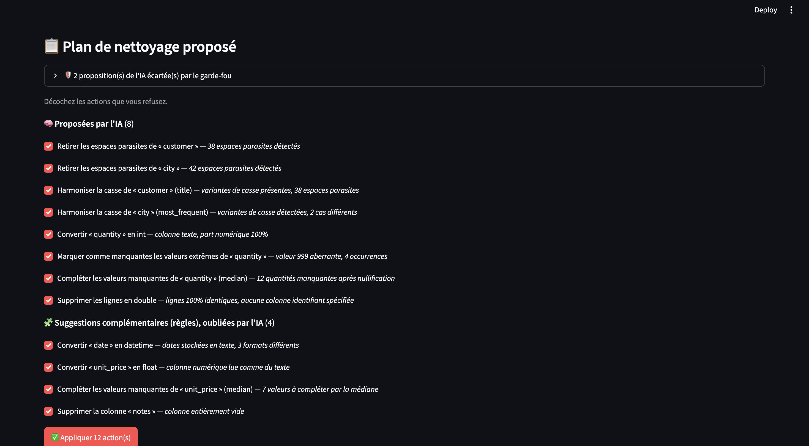

# 🧹 AI Data Cleaning Agent

Un agent IA qui inspecte un fichier **CSV ou Excel**, détecte les problèmes de qualité et propose un plan de nettoyage justifié. **Rien n'est appliqué sans validation humaine** (human-in-the-loop).

> Stack : **LangGraph** · **LLM via Groq** · **Python & Pandas** · **Streamlit**



*Le plan : actions proposées par l'IA, suggestions complémentaires des règles, et propositions écartées par le garde-fou.*

## ✨ Ce qui le différencie

- **Tool calling** : le LLM choisit lui-même quelles colonnes inspecter (`inspect_column`, `find_duplicates`, `detect_outliers`…).
- **Exécution sûre** : le LLM ne génère **aucun code**. Il choisit parmi 10 opérations en liste blanche, exécutées par un moteur Pandas contrôlé.
- **Garde-fou** : chaque proposition de l'IA est vérifiée sur les données avant d'être affichée. Les actions impossibles ou inutiles (colonne inventée, casse déjà cohérente, suppression d'une colonne qui contient des données…) sont écartées, avec la raison affichée.
- **IA + règles** : un moteur de règles complète ce que l'IA oublie (« suggestions complémentaires »).
- **Prudence sur les données** : les valeurs extrêmes ne sont traitées d'office que si ce sont des fautes de saisie évidentes (999, -1…) ; on n'invente jamais d'email ni d'identifiant.
- **Reproductible** : export du fichier propre **et** d'un script Pandas qui refait exactement le même nettoyage.

## 🔁 Fonctionnement

```
profile → agent ⇄ tools → plan → garde-fou → ⏸ validation humaine → execute → rapport
```

| Fichier | Rôle |
|---|---|
| `app.py` | Interface Streamlit, étapes de l'agent affichées en direct |
| `agent/graph.py` | Graphe LangGraph : boucle de tool calling, plan structuré, pause `interrupt()` |
| `agent/tools.py` | Chargement CSV/Excel (en-tête détecté) + outils d'inspection en lecture seule |
| `agent/engine.py` | Moteur en liste blanche, règles, garde-fou, export du script |
| `data/dirty_cafe_sales.csv` | Fichier de démo volontairement sale |

**Opérations autorisées :** `drop_total_rows`, `drop_duplicates` (lignes identiques ou même identifiant), `drop_column`, `strip_whitespace`, `normalize_case`, `convert_type`, `nullify_outliers`, `clip_outliers`, `fill_missing`.

## 🚀 Lancer le projet

```bash
git clone https://github.com/<ton-compte>/data-cleaning-agent.git
cd data-cleaning-agent
pip install -r requirements.txt
cp .env.example .env        # puis colle ta clé Groq (gratuite : https://console.groq.com/keys)
streamlit run app.py
```

Sans clé, l'application tourne en **mode démo** (plan généré par les règles, sans LLM).

## 📊 Exemple (fichier de démo)

| | Avant | Après |
|---|---|---|
| Lignes | 212 | 200 (12 doublons supprimés) |
| Dates | 3 formats mélangés | un seul format |
| Villes | `paris`, `LYON`, ` Lyon` | `Paris`, `Lyon` |
| Quantité aberrante | `999` | médiane (3) |
| Emails manquants | vides | laissés vides (aucune valeur inventée) |

## ⚠️ Limites

- Fonctionne sur des **tableaux** (une ligne = un enregistrement), pas sur des documents mis en page.
- Un résumé des données (valeurs fréquentes, exemples) est envoyé au LLM : n'utilisez pas de données confidentielles.
